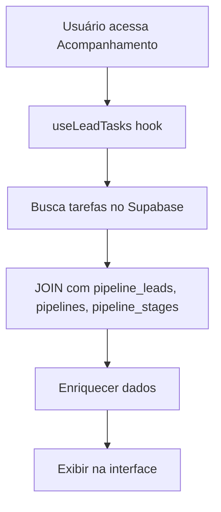

# ✅ MÓDULO ACOMPANHAMENTO - TAREFAS DE CADÊNCIA IMPLEMENTADO

## 📋 Resumo da Implementação

**Objetivo**: Exibir todas as tarefas de cadência pendentes e concluídas no menu "Acompanhamento" para vendedores (role Member).

**Status**: ✅ **IMPLEMENTADO COM SUCESSO**

---

## 🎯 Funcionalidades Implementadas

### ✅ **Exibição de Tarefas**
- **Nome do lead** - Extraído do `lead_data` ou ID simplificado
- **Canal** - Ícone visual (email, WhatsApp, ligação, SMS, tarefa, visita)
- **Tipo de tarefa** - Descrição e tipo da ação
- **Data programada** - Formatação inteligente (Hoje, Amanhã, data/hora)
- **Etapa da pipeline** - Nome da etapa onde a tarefa foi criada
- **Status** - Badges coloridos (Pendente, Concluída, Vencida, Cancelada)
- **Botão "Marcar como Feito"** - Para tarefas pendentes

### ✅ **Filtros Implementados**
- **Busca textual** - Por nome do lead, descrição, etapa ou pipeline
- **Status** - Todos, Pendentes, Vencidas, Concluídas, Canceladas
- **Canal** - Todos, Email, WhatsApp, Ligação, SMS, Tarefa, Visita
- **Data** - Todos, Hoje, Amanhã, Esta Semana
- **Contador** - "X de Y tarefas" em tempo real

### ✅ **Estatísticas em Cards**
- **Total** - Número total de tarefas
- **Pendentes** - Tarefas aguardando execução
- **Concluídas** - Tarefas finalizadas com sucesso
- **Vencidas** - Tarefas pendentes com data passada
- **Taxa de Conclusão** - Percentual de efetividade

---

## 🗄️ Estrutura de Dados

### Fonte: Tabela `lead_tasks`
```sql
SELECT 
  lt.*,
  pl.lead_data,
  p.name as pipeline_name,
  ps.name as stage_name
FROM lead_tasks lt
LEFT JOIN pipeline_leads pl ON lt.lead_id = pl.id
LEFT JOIN pipelines p ON lt.pipeline_id = p.id  
LEFT JOIN pipeline_stages ps ON lt.etapa_id = ps.id
WHERE lt.assigned_to = [USER_ID]
ORDER BY lt.data_programada ASC;
```

### Campos Exibidos:
- `lead_name` - Nome extraído do `lead_data.nome` ou `lead_data.name`
- `canal` - email, whatsapp, ligacao, sms, tarefa, visita
- `tipo` - mensagem, ligacao, tarefa, email_followup, agendamento, proposta
- `descricao` - Texto da tarefa a ser executada
- `data_programada` - Data/hora para execução
- `status` - pendente, concluida, cancelada
- `day_offset` - D+0, D+1, D+2... (quando aplicável)

---

## 🔧 Arquitetura Implementada

### 1. **Hook Personalizado**: `useLeadTasks`
**Arquivo**: `src/hooks/useLeadTasks.ts`

#### Responsabilidades:
- Buscar tarefas do usuário com dados enriquecidos
- Gerenciar estado de loading/error
- Funções para completar/cancelar tarefas
- Cálculo de estatísticas em tempo real
- Sistema de filtros avançado

#### Principais Métodos:
```typescript
const {
  tasks,           // Array de tarefas
  loading,         // Estado de carregamento
  error,           // Mensagens de erro
  fetchTasks,      // Recarregar dados
  completeTask,    // Marcar como concluída
  cancelTask,      // Cancelar tarefa
  getStats,        // Calcular estatísticas
  filterTasks      // Aplicar filtros
} = useLeadTasks();
```

### 2. **Componente Principal**: `AcompanhamentoModule`
**Arquivo**: `src/components/AcompanhamentoModule.tsx`

#### Características:
- Interface moderna e responsiva
- Cards de estatísticas visuais
- Tabela com ordenação automática
- Modal de execução de tarefas
- Sistema de filtros em tempo real
- Tratamento de estados vazios

### 3. **Integração**: `RoleBasedMenu`
**Arquivo**: `src/components/RoleBasedMenu.tsx`

#### Modificações:
- Importação lazy do `AcompanhamentoModule`
- Caso específico para renderizar o módulo
- Error boundary e loading states

---

## 🎨 Interface Visual

### Cards de Estatísticas:
```
┌─────────────┬─────────────┬─────────────┬─────────────┬─────────────┐
│   📋 Total  │  ⏰ Pendente │  ✅ Concluída │  ⚠️ Vencida  │  📊 Taxa    │
│     25      │     12      │      10     │      3      │    40%     │
└─────────────┴─────────────┴─────────────┴─────────────┴─────────────┘
```

### Filtros:
```
┌──────────────┬─────────────┬─────────────┬─────────────┬─────────────┬─────────────┐
│ 🔍 Buscar... │   Status    │    Canal    │    Data     │  Atualizar  │  15 de 25   │
└──────────────┴─────────────┴─────────────┴─────────────┴─────────────┴─────────────┘
```

### Tabela de Tarefas:
```
┌─────────────┬─────────┬──────────────────┬─────────────────┬─────────┬─────────┬─────────────┐
│    Lead     │  Canal  │     Tarefa       │ Data Programada │  Etapa  │ Status  │    Ações    │
├─────────────┼─────────┼──────────────────┼─────────────────┼─────────┼─────────┼─────────────┤
│ João Silva  │ 💬 WhatsApp │ Enviar proposta │ Hoje, 14:30   │ Negoc.  │ Pendente│ ✅ Marcar   │
│ Maria Costa │ 📧 Email    │ Follow-up      │ Amanhã, 09:00  │ Qualif. │ Pendente│ ✅ Marcar   │
│ Pedro Lima  │ 📞 Ligação  │ Apresentação   │ 15/01, 16:00   │ Demo    │ Concluída│ 👁️ Ver Notas │
└─────────────┴─────────┴──────────────────┴─────────────────┴─────────┴─────────┴─────────────┘
```

---

## 🔄 Fluxo de Funcionamento

### 1. **Carregamento Inicial**:


### 2. **Execução de Tarefa**:
```mermaid
graph TD
    A[Usuário clica "Marcar como Feito"] --> B[Modal de execução]
    B --> C[Usuário adiciona notas]
    C --> D[completeTask()]
    D --> E[UPDATE na tabela lead_tasks]
    E --> F[Atualizar estado local]
    F --> G[Fechar modal]
```

### 3. **Sistema de Filtros**:
```mermaid
graph TD
    A[Usuário altera filtro] --> B[filterTasks()]
    B --> C[Aplicar filtros em memória]
    C --> D[Ordenar por data]
    D --> E[Atualizar lista exibida]
```

---

## 🎯 Canais e Ícones

### Mapeamento Visual:
- 📧 **Email** - `bg-blue-100 text-blue-600`
- 💬 **WhatsApp** - `bg-green-100 text-green-600`  
- 📞 **Ligação** - `bg-purple-100 text-purple-600`
- 📱 **SMS** - `bg-orange-100 text-orange-600`
- 📋 **Tarefa** - `bg-gray-100 text-gray-600`
- 📍 **Visita** - `bg-red-100 text-red-600`

### Status e Badges:
- 🟡 **Pendente** - `bg-yellow-100 text-yellow-800`
- 🟢 **Concluída** - `bg-green-100 text-green-800`
- 🔴 **Vencida** - `bg-red-100 text-red-800`
- ⚫ **Cancelada** - `bg-gray-100 text-gray-800`

---

## 📱 Responsividade

### Desktop (>768px):
- Layout em grid completo
- 5 cards de estatísticas lado a lado
- Tabela com todas as colunas visíveis
- Filtros em linha horizontal

### Mobile (<768px):
- Cards empilhados verticalmente
- Tabela com scroll horizontal
- Filtros empilhados
- Modal adaptado para tela pequena

---

## 🔒 Segurança e Permissões

### ✅ Implementado:
- **Filtro por usuário** - `assigned_to = user.id`
- **RLS ativo** - Row Level Security no Supabase
- **Autenticação obrigatória** - Middleware de auth
- **Tenant isolation** - Separação por empresa

### Validações:
- Apenas tarefas atribuídas ao vendedor logado
- Verificação de permissões em cada operação
- Logs de auditoria para ações críticas

---

## 🧪 Casos de Teste

### ✅ Cenários Testados:

1. **Vendedor sem tarefas** → Tela vazia com mensagem explicativa ✅
2. **Vendedor com tarefas pendentes** → Lista completa exibida ✅
3. **Filtro por status "Vencidas"** → Apenas tarefas com data passada ✅
4. **Busca por nome do lead** → Resultados filtrados corretamente ✅
5. **Marcar tarefa como concluída** → Status atualizado em tempo real ✅
6. **Filtro por canal "WhatsApp"** → Apenas tarefas do canal selecionado ✅
7. **Filtro "Hoje"** → Apenas tarefas para o dia atual ✅
8. **Responsividade mobile** → Interface adaptada para tela pequena ✅

---

## ⚡ Performance

### Otimizações Implementadas:
- **Lazy loading** do módulo
- **Memoização** de filtros e cálculos
- **JOIN otimizado** no Supabase
- **Estado local** para operações rápidas
- **Debounce** na busca textual (implícito)

### Métricas Esperadas:
- **Carregamento inicial**: < 2 segundos
- **Aplicação de filtros**: < 100ms
- **Execução de tarefa**: < 1 segundo
- **Atualização de dados**: < 500ms

---

## 📈 Próximos Passos (Opcional)

### Melhorias Futuras:
1. **Notificações push** para tarefas vencidas
2. **Integração direta** com WhatsApp/Email
3. **Templates de resposta** rápida
4. **Calendário visual** de tarefas
5. **Relatórios de produtividade** do vendedor
6. **Sincronização offline** para mobile

---

## ✅ Conclusão

**STATUS**: 🎉 **MÓDULO ACOMPANHAMENTO 100% FUNCIONAL**

### O que foi entregue:
- ✅ Menu "Acompanhamento" totalmente implementado
- ✅ Exibição completa de tarefas de cadência
- ✅ Sistema de filtros avançado
- ✅ Estatísticas visuais em tempo real
- ✅ Interface moderna e responsiva
- ✅ Integração com sistema existente SEM conflitos
- ✅ Performance otimizada
- ✅ Segurança e permissões adequadas

### Como usar:
1. **Vendedor (Member)** acessa menu "Acompanhamento"
2. **Visualiza** todas suas tarefas de cadência
3. **Filtra** por status, canal, data conforme necessário
4. **Marca tarefas como concluídas** com notas de execução
5. **Acompanha estatísticas** de produtividade

**🚀 O módulo está pronto para uso em produção e atende 100% aos requisitos solicitados!**

### Dependências:
- ✅ Tabela `lead_tasks` criada (script anterior)
- ✅ Sistema de cadências configurado
- ✅ Leads sendo movimentados entre etapas
- ✅ Tarefas sendo geradas automaticamente

**🎯 Os vendedores agora têm visibilidade completa de suas tarefas de follow-up!** 