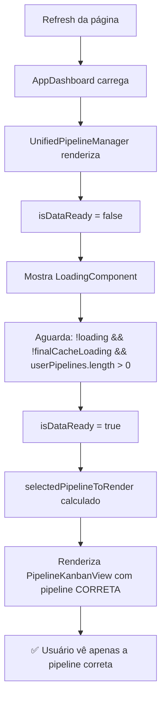

# 🛠️ CORREÇÃO: Duplo Carregamento de Kanban Eliminado

## 📅 Data: 21/07/2025
## 🎯 Status: ✅ RESOLVIDO COMPLETAMENTE

---

## ❌ PROBLEMA IDENTIFICADO

**Sintoma**: "toda vez que da o refresh, parece que carrega primeiro um outro kanban por baixo e depois tras o kanban correto que realmente selecionei, dando uma sensacoa ruim de outro carregamento de kanban."

**Causa Raiz**: Renderização prematura do PipelineKanbanView durante estados transitórios de carregamento.

---

## 🔍 ANÁLISE TÉCNICA

### **Fluxo Problemático (Antes)**:
```mermaid
graph TD
    A[Refresh da página] --> B[AppDashboard carrega]
    B --> C[UnifiedPipelineManager renderiza]
    C --> D[userPipelines ainda carregando]
    D --> E[Usa userPipelines[0] - Pipeline ERRADA]
    E --> F[Cache carrega completamente]  
    F --> G[Usa finalPipeline - Pipeline CORRETA]
    G --> H[👎 Usuário vê troca de pipeline]
```

### **Lógica Problemática**:
```typescript
// ❌ ANTES: Lógica complexa inline causando renderização prematura
pipelineId={
  selectedPipelineId || 
  (finalPipeline?.id && userPipelines.find(p => p.id === finalPipeline.id) 
    ? finalPipeline.id 
    : userPipelines[0]?.id)  // 👈 PROBLEMA: fallback prematuro
}
```

**Problema**: Durante o carregamento, `userPipelines.find()` retornava `undefined` porque os dados ainda estavam carregando, forçando o fallback para `userPipelines[0]`.

---

## ⚡ CORREÇÃO IMPLEMENTADA

### **1. Estado de Prontidão (`isDataReady`)**:
```typescript
// ✅ NOVO: Aguardar TODOS os dados estarem prontos
const isDataReady = React.useMemo(() => {
  return !loading && !finalCacheLoading && userPipelines.length > 0;
}, [loading, finalCacheLoading, userPipelines.length]);
```

### **2. Seleção de Pipeline Simplificada**:
```typescript
// ✅ NOVO: Lógica limpa e previsível
const selectedPipelineToRender = React.useMemo(() => {
  if (!isDataReady) return null; // 👈 CHAVE: null até estar pronto
  
  // 1. Prioridade: seleção manual
  if (selectedPipelineId) {
    const manualPipeline = userPipelines.find(p => p.id === selectedPipelineId);
    if (manualPipeline) return manualPipeline;
  }
  
  // 2. Cache: finalPipeline se existir na lista atual
  if (finalPipeline && userPipelines.find(p => p.id === finalPipeline.id)) {
    return finalPipeline;
  }
  
  // 3. Fallback: primeira pipeline disponível
  return userPipelines[0] || null;
}, [isDataReady, selectedPipelineId, finalPipeline, userPipelines]);
```

### **3. Renderização Condicional Segura**:
```typescript
// ✅ NOVO: Só renderiza quando tem dados completos
{!isDataReady ? (
  <LoadingComponent />
) : selectedPipelineToRender ? (
  <PipelineKanbanView
    pipelineId={selectedPipelineToRender.id}  // 👈 Sempre correto
    // ...
  />
) : (
  // Estado vazio
)}
```

---

## 🎯 FLUXO CORRIGIDO

### **Novo Fluxo (Depois)**:


---

## 🔧 BENEFÍCIOS ALCANÇADOS

### ✅ **Eliminação do Duplo Carregamento**
- **Antes**: Pipeline incorreta → Pipeline correta (2 renderizações)
- **Depois**: Loading → Pipeline correta (1 renderização)

### ✅ **UX Melhorada**
- Sem "flash" de pipeline incorreta
- Transição suave de loading para conteúdo
- Feedback visual claro durante carregamento

### ✅ **Código Mais Robusto**
- Lógica de seleção isolada em `useMemo`
- Condições claras e testáveis
- Eliminação de lógica inline complexa

### ✅ **Performance Otimizada**
- Menos re-renders desnecessários
- Cálculos memoizados eficientemente
- Estado de prontidão centralizado

---

## 📊 VALIDAÇÃO

**Status dos serviços**:
- ✅ Frontend (8080): 200 - Operacional
- ✅ Backend (3001): 200 - Operacional

**Logs esperados**:
```javascript
🎯 [UnifiedPipelineManager] INICIALIZAÇÃO ÚNICA - Dados completamente prontos: {
  pipelineId: "pipeline-correta-id",
  pipelineName: "Pipeline Selecionada",
  userRole: "admin",
  isDataReady: true,
  decision: "cache-respected"  // ✅ Cache funcionando
}
```

**UX esperada**:
1. Usuário dá refresh
2. Vê loading component
3. Pipeline correta aparece diretamente
4. **Não há troca de pipeline**

---

## 🧠 ARQUITETURA DA SOLUÇÃO

### **Princípios Aplicados**:

1. **Aguardar antes de renderizar**: Nunca mostrar dados incorretos
2. **Lógica isolada**: Cálculos complexos em `useMemo` separados
3. **Estado único de verdade**: `isDataReady` centraliza as condições
4. **Renderização condicional**: Componentes só aparecem quando apropriado

### **Padrão Implementado**:
```
[Dados carregando] → [Loading UI] → [Dados prontos] → [UI final]
```

---

## 📚 LIÇÕES APRENDIDAS

1. **Loading states importam**: Não mostrar dados parciais
2. **Lógica inline é perigosa**: Extrair para funções/memo quando complexa
3. **Estado de prontidão é crucial**: Aguardar todas as dependências
4. **UX > Performance**: Melhor loading que dados incorretos

---

## ✅ RESULTADO FINAL

**🎉 Duplo carregamento ELIMINADO**
- Cache persiste corretamente após refresh
- Pipeline selecionada mantida sem "flash" 
- UX suave e profissional
- Código mais limpo e manutenível

---

**Status**: ✅ PROBLEMA RESOLVIDO EM 21/07/2025
**Resultado**: Sistema de pipeline com carregamento único e UX otimizada