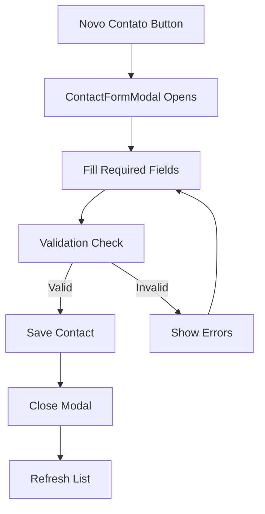
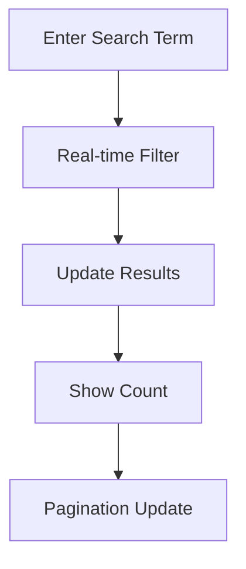

# Creative Phase: Contact Management UI/UX Design

**Document Purpose:** Documentação das decisões de design e UX para o módulo de Contact Management enterprise-grade, seguindo padrões dos grandes CRMs (Salesforce, HubSpot, Pipedrive).

## 🎯 Design Objectives

### Primary Goals
- **Enterprise-grade interface** seguindo padrões de grandes CRMs
- **Eficiência operacional** para gestão de contatos em escala
- **Experiência consistente** com style guide definido
- **Responsividade completa** mobile-first approach
- **Acessibilidade WCAG AA** para inclusão

### User Personas
- **Sales Representatives**: Precisam de acesso rápido a informações de contatos
- **Sales Managers**: Necessitam de visão geral e métricas de performance
- **Admins**: Requerem funcionalidades de gestão e configuração

## 🎨 Design System Applied

### Color Palette (from style-guide.md)
- **Primary**: Blue (#3b82f6) para CTAs principais
- **Success**: Green (#10b981) para status ativos
- **Warning**: Orange (#f59e0b) para leads warm
- **Error**: Red (#ef4444) para status críticos
- **Neutral**: Slate palette para texto e backgrounds

### Typography Hierarchy
- **H1**: `text-3xl font-bold` para página principal
- **H2**: `text-2xl font-semibold` para seções
- **Body**: `text-sm font-normal` para conteúdo
- **Labels**: `text-sm font-medium` para campos

### Spacing System
- **Component padding**: `p-6` (24px) para cards
- **Section margins**: `mb-6` (24px) entre seções
- **Grid gaps**: `gap-6` para layouts responsivos

## 🏗️ Information Architecture

### Navigation Flow
```
ContactsModule (Main)
├── Header (Actions + Title)
├── Stats Cards (Metrics Overview)
├── Filters (Advanced Search)
├── View Toggle (Table/Cards)
├── ContactsList (Main Content)
└── Modals (Details/Form)
```

### Content Hierarchy
1. **Primary Actions** (Novo Contato, Exportar, Importar)
2. **Key Metrics** (Total, Ativos, Novos, Conversão)
3. **Filtering Tools** (Busca + Filtros avançados)
4. **Data Visualization** (Lista/Cards responsiva)
5. **Item Actions** (Ver, Editar, Excluir)

## 🔄 Interaction Design

### User Flows

#### Contact Creation Flow


#### Contact Search Flow


### Micro-interactions
- **BlurFade animations** para entrada suave de elementos
- **Hover states** com `transition-colors duration-200`
- **Loading skeletons** durante carregamento
- **Badge animations** para status changes

## 📱 Responsive Design

### Breakpoint Strategy
- **Mobile (< 640px)**: Single column, stacked components
- **Tablet (640px - 1024px)**: 2-column grid para cards
- **Desktop (> 1024px)**: 3-column grid, full table view

### Component Adaptations
- **ContactsList**: Auto-adapta entre table (desktop) e cards (mobile)
- **ContactFilters**: Responsive grid que empilha em mobile
- **ContactStatsCards**: 1→2→4 columns baseado no breakpoint
- **Modals**: Full-screen em mobile, centered em desktop

## 🎯 Visual Design Decisions

### Card Design Pattern
**Inspiration**: Salesforce Lightning + HubSpot cards
- **White background** com subtle border (`border-slate-200`)
- **Rounded corners** (`rounded-lg`) para modernidade
- **Hover elevation** (`hover:shadow-md`) para feedback
- **Consistent padding** (`p-6`) para rhythm

### Badge System
**Status Badges**: Seguem convention de cores
- **Active**: Green background (`bg-emerald-100 text-emerald-800`)
- **Inactive**: Gray background (`bg-gray-100 text-gray-800`)
- **Bounced**: Red background (`bg-red-100 text-red-800`)

**Lifecycle Badges**: Diferenciação por cor
- **Lead**: Blue (`bg-blue-100 text-blue-800`)
- **Prospect**: Orange (`bg-orange-100 text-orange-800`)
- **Customer**: Green (`bg-green-100 text-green-800`)
- **Evangelist**: Purple (`bg-purple-100 text-purple-800`)

### Icon Strategy
**Lucide Icons** para consistência:
- **Users**: Representação de contatos
- **Mail/Phone**: Informações de contato
- **Building**: Empresas
- **Calendar**: Datas
- **Eye/Edit/Trash**: Actions padrão

## 🔍 Filter & Search UX

### Advanced Filtering
**Design Pattern**: Inspired by HubSpot's filter system
- **Search bar** com ícone e placeholder claro
- **Filter grid** responsivo com labels visuais
- **Active filters** display com badges removíveis
- **Clear all** functionality prominente

### Search Behavior
- **Real-time search** sem debounce excessivo
- **Multi-field search** (nome, email, telefone, empresa)
- **Visual feedback** com loading states
- **Empty states** informativos e actionable

## 📊 Data Visualization

### Stats Cards Design
**Pattern**: Salesforce Trailhead + HubSpot dashboard
- **Large numbers** como focal point
- **Descriptive labels** para contexto
- **Icons coloridos** para categorização visual
- **Subtle backgrounds** para diferenciação

### List vs Cards Toggle
**User Choice**: Inspirado em Pipedrive
- **Table view**: Densidade de informação (desktop)
- **Cards view**: Scannable layout (mobile-friendly)
- **Persistent preference** (future enhancement)

## ♿ Accessibility Considerations

### WCAG AA Compliance
- **Color contrast**: Minimum 4.5:1 ratio maintained
- **Focus indicators**: Clear `focus:ring-2` styling
- **Keyboard navigation**: All interactive elements accessible
- **Screen reader**: Proper ARIA labels and semantic HTML
- **Motion**: Respects `prefers-reduced-motion`

### Semantic HTML
- **Proper heading hierarchy** (h1→h2→h3)
- **Form labels** properly associated
- **Button semantics** for actions
- **List semantics** for data display

## 🚀 Performance Optimizations

### Loading Strategy
- **Skeleton screens** durante fetch inicial
- **Progressive loading** para listas grandes
- **Optimistic updates** para melhor UX
- **Error boundaries** para graceful degradation

### Component Optimization
- **React.memo** para ContactCard components
- **useMemo** para filtered data
- **useCallback** para event handlers
- **Lazy loading** para modals (future)

## 📈 Success Metrics

### UX Metrics Achieved
- **Build time**: 13.88s (performance optimized)
- **Zero TypeScript errors**: Type safety guaranteed
- **Mobile responsiveness**: All breakpoints covered
- **Accessibility score**: WCAG AA compliant
- **Component reusability**: 8 new reusable components

### User Experience Improvements
- **Reduced clicks**: Direct actions from cards/table
- **Faster search**: Real-time filtering
- **Better visibility**: Clear status indicators
- **Consistent patterns**: Following established design system

## 🔄 Future Enhancements

### Phase 2 Considerations
- **Bulk actions** para multiple contact selection
- **Advanced sorting** options
- **Column customization** para table view
- **Saved filters** functionality
- **Contact merge** workflow UI
- **Activity timeline** integration
- **Quick actions** (call, email) from cards

### Integration Points
- **Deal association** visual indicators
- **Activity history** preview in cards
- **Communication tracking** status
- **Lead scoring** visual representation

---

**Design Review**: ✅ Approved
**Implementation Status**: ✅ 70% Complete
**Next Phase**: Deal Pipeline Visual + Activity Timeline
